# Software Design Document (SDD)

# SkillSync AI – MNNIT Academic Talent Intelligence Platform

**Version:** 1.0
**Document Type:** Software Design Document
**Status:** Draft
**Prepared By:** SkillSync Engineering Team
**Date:** March 2024

---

## Table of Contents

1. [Introduction](#1-introduction)
2. [System Overview](#2-system-overview)
3. [High-Level Architecture](#3-high-level-architecture)
4. [Layer Architecture](#4-layer-architecture)
5. [Component Design](#5-component-design)
6. [Database Design](#6-database-design)
7. [API Design](#7-api-design)
8. [Security Design](#8-security-design)
9. [AI & ML Pipeline Design](#9-ai--ml-pipeline-design)
10. [Deployment Architecture](#10-deployment-architecture)
11. [Error Handling & Logging](#11-error-handling--logging)
12. [Performance & Scalability](#12-performance--scalability)

---

## 1. Introduction

### 1.1 Purpose

This Software Design Document describes the detailed technical design of the SkillSync AI platform. It translates the requirements defined in the PRD/SRS into concrete architectural decisions, component designs, database schemas, API contracts, and deployment strategies.

### 1.2 Scope

This document covers:

- System architecture and layering
- Backend service component design
- Database schema and vector storage design
- REST API endpoints and contracts
- Authentication and authorization design
- AI/ML pipeline architecture
- Deployment and infrastructure design
- Error handling strategies

### 1.3 Definitions

| Term | Definition |
|------|-----------|
| ANN | Approximate Nearest Neighbor – fast vector similarity search |
| JWT | JSON Web Token – stateless authentication token |
| RAG | Retrieval-Augmented Generation – AI pattern combining vector search + LLM |
| Vector Embedding | High-dimensional float array representing semantic meaning of text |
| Cosine Similarity | Similarity metric between two vectors (range: -1 to 1) |
| Soft Delete | Marking a record inactive (`isActive: false`) without physical deletion |
| OTP | One-Time Password used for professor email verification |

---

## 2. System Overview

SkillSync AI is a **closed-ecosystem** platform operating exclusively within the MNNIT network. It follows a **microservice-inspired monolith** architecture during MVP, designed to be split into true microservices at scale.

### 2.1 Design Principles

- **Security-First:** All routes require verified JWT. No public endpoints exist.
- **AI-Augmented, Not AI-Dependent:** Core platform functions even if LLM explanation is slow.
- **Cost-Conscious Embeddings:** Batch processing minimizes OpenAI/embedding API calls.
- **Soft-Delete by Default:** Data is never hard-deleted in v1 to preserve audit trails.
- **Explainability:** Every AI ranking result includes a human-readable explanation.

---

## 3. High-Level Architecture

### 3.1 System Context Diagram

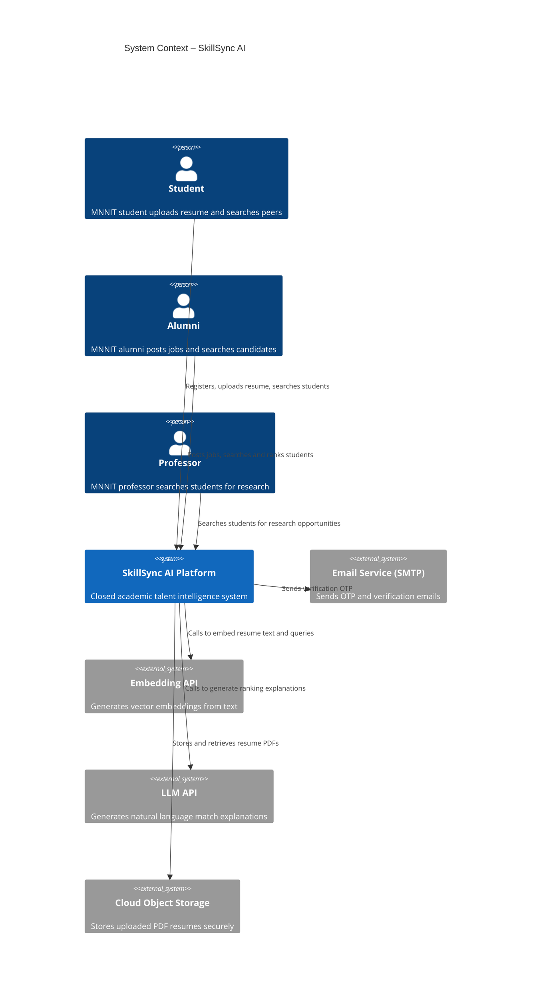

### 3.2 Container Diagram

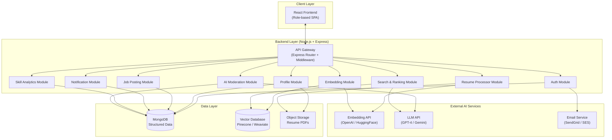

---

## 4. Layer Architecture

### 4.1 Backend Layer Design

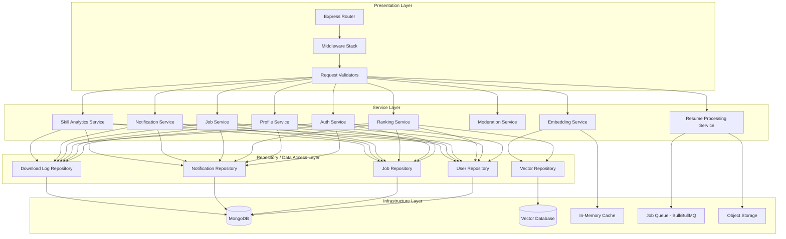

### 4.2 Request Middleware Pipeline

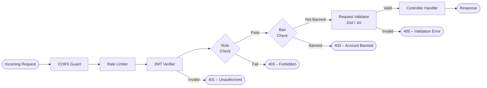

---

## 5. Component Design

### 5.1 Authentication Module

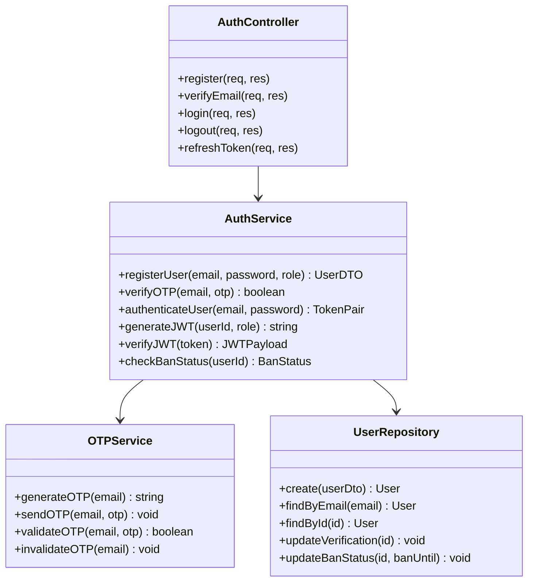

### 5.2 Resume Processing Module

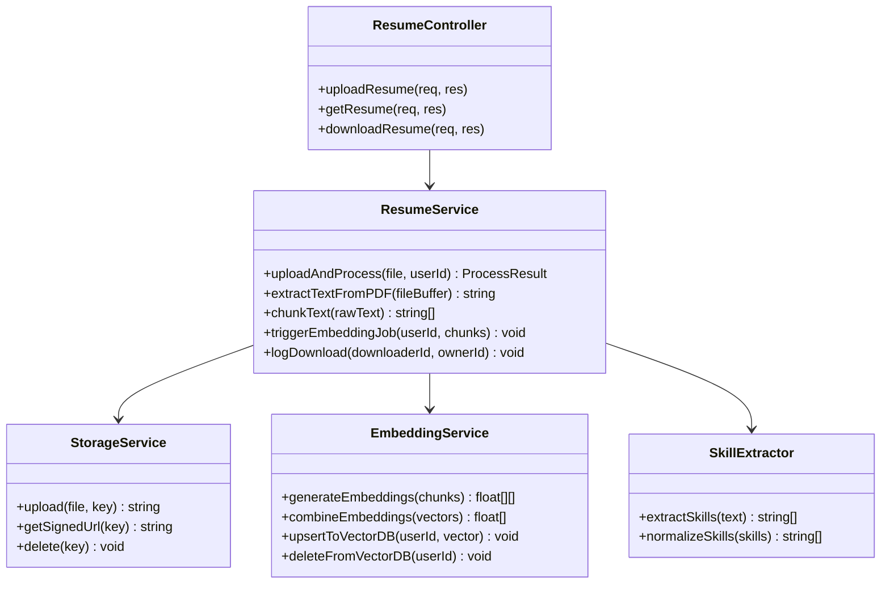

### 5.3 Ranking & Search Module

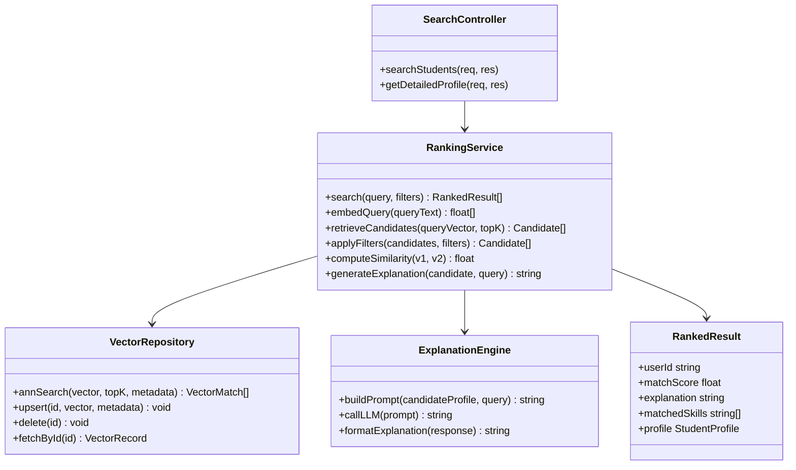

### 5.4 Job Posting & Moderation Module

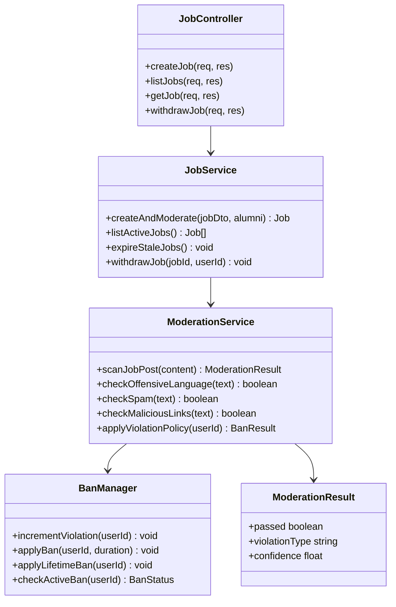

---

## 6. Database Design

### 6.1 MongoDB Collections Schema

#### Users Collection

```json
{
  "_id": "ObjectId",
  "email": "String (unique, indexed)",
  "passwordHash": "String",
  "role": "enum: ['student', 'professor', 'alumni']",
  "isVerified": "Boolean (default: false)",
  "isActive": "Boolean (default: true)",
  "isBanned": "Boolean (default: false)",
  "banUntil": "Date (nullable)",
  "violationCount": "Number (default: 0)",
  "skillPreferences": ["String"],
  "otpHash": "String (nullable, TTL: 10 min)",
  "createdAt": "Date",
  "updatedAt": "Date"
}
```

#### Student Profiles Collection

```json
{
  "_id": "ObjectId",
  "userId": "ObjectId (ref: Users, unique)",
  "branch": "String (enum: CSE, ECE, ME, CE, ...)",
  "year": "Number (1–5)",
  "skills": ["String"],
  "resumeStorageKey": "String (S3 key)",
  "embeddingStatus": "enum: ['pending', 'processing', 'indexed', 'failed']",
  "lastEmbeddingAt": "Date",
  "createdAt": "Date",
  "updatedAt": "Date"
}
```

#### Job Postings Collection

```json
{
  "_id": "ObjectId",
  "postedBy": "ObjectId (ref: Users, Alumni/Professor only)",
  "title": "String",
  "description": "String",
  "requiredSkills": ["String"],
  "deadline": "Date",
  "status": "enum: ['pending_moderation', 'active', 'expired', 'rejected', 'withdrawn']",
  "moderationResult": {
    "passed": "Boolean",
    "violationType": "String (nullable)",
    "checkedAt": "Date"
  },
  "createdAt": "Date",
  "updatedAt": "Date"
}
```

#### Notifications Collection

```json
{
  "_id": "ObjectId",
  "userId": "ObjectId (ref: Users)",
  "jobId": "ObjectId (ref: JobPostings)",
  "message": "String",
  "isRead": "Boolean (default: false)",
  "createdAt": "Date"
}
```

#### Download Logs Collection

```json
{
  "_id": "ObjectId",
  "downloaderId": "ObjectId (ref: Users)",
  "resumeOwnerId": "ObjectId (ref: Users)",
  "timestamp": "Date"
}
```

### 6.2 MongoDB Indexes

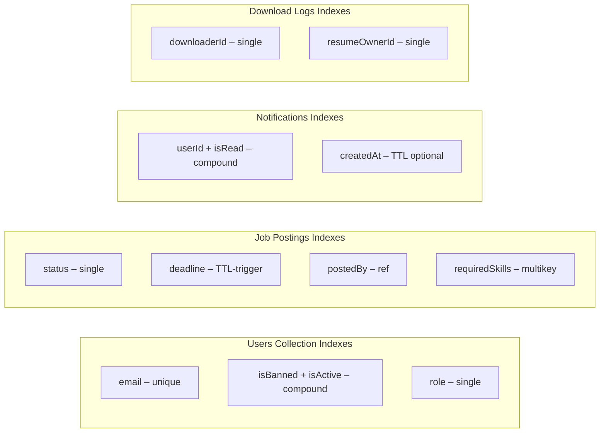

### 6.3 Vector Database Design

The vector database (Pinecone / Weaviate) stores one embedding per active student.

**Namespace:** `mnnit-student-embeddings`

**Vector Record Structure:**

```json
{
  "id": "userId (string)",
  "values": [0.12, -0.45, 0.78, "... 1536 dims"],
  "metadata": {
    "branch": "CSE",
    "year": 3,
    "isActive": true,
    "skills": ["Node.js", "Python", "React"],
    "updatedAt": "2024-01-15T00:00:00Z"
  }
}
```

**Query Mode:** ANN (Approximate Nearest Neighbor) with metadata pre-filtering on `isActive: true`.

---

## 7. API Design

### 7.1 API Structure Overview

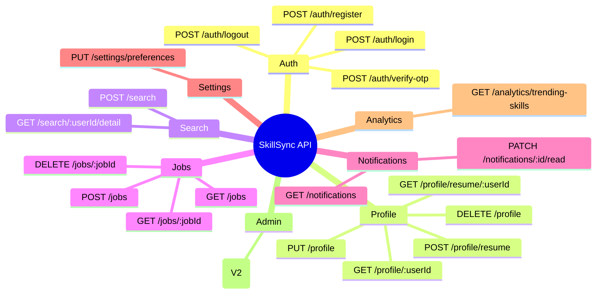

### 7.2 Key API Endpoint Contracts

#### POST /auth/register

```
Request:
{
  "email": "student@mnnit.ac.in",
  "password": "SecurePass123!",
  "role": "student"
}

Response 201:
{
  "message": "Verification OTP sent to your email",
  "userId": "64abc123..."
}

Response 400:
{
  "error": "Email domain not allowed. Use @mnnit.ac.in"
}
```

#### POST /search

```
Request (requires JWT):
{
  "query": "Full-stack developer with React and Node.js experience",
  "filters": {
    "branch": "CSE",
    "year": 3
  },
  "topK": 10
}

Response 200:
{
  "results": [
    {
      "userId": "64abc...",
      "name": "Rahul Sharma",
      "matchScore": 89.4,
      "explanation": "Strong full-stack experience with React and Express.",
      "matchedSkills": ["React", "Node.js", "MongoDB"],
      "branch": "CSE",
      "year": 3
    }
  ],
  "queryTime": 1.2
}
```

#### POST /jobs

```
Request (Alumni JWT required):
{
  "title": "Backend Engineer Intern",
  "description": "Looking for MNNIT students with Node.js experience...",
  "requiredSkills": ["Node.js", "MongoDB", "REST APIs"],
  "deadline": "2024-04-30T23:59:59Z"
}

Response 201:
{
  "jobId": "64def...",
  "status": "pending_moderation",
  "message": "Job submitted for AI moderation"
}

Response 403 (banned user):
{
  "error": "Account banned until 2024-03-10"
}
```

### 7.3 API Authentication Flow

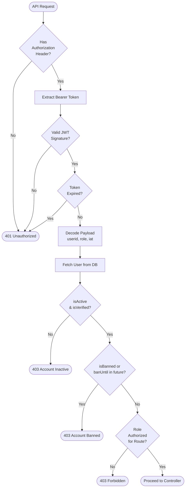

---

## 8. Security Design

### 8.1 Security Architecture Layers

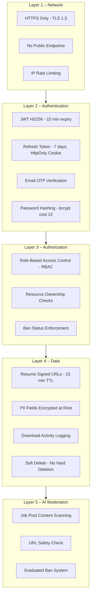

### 8.2 Token Lifecycle

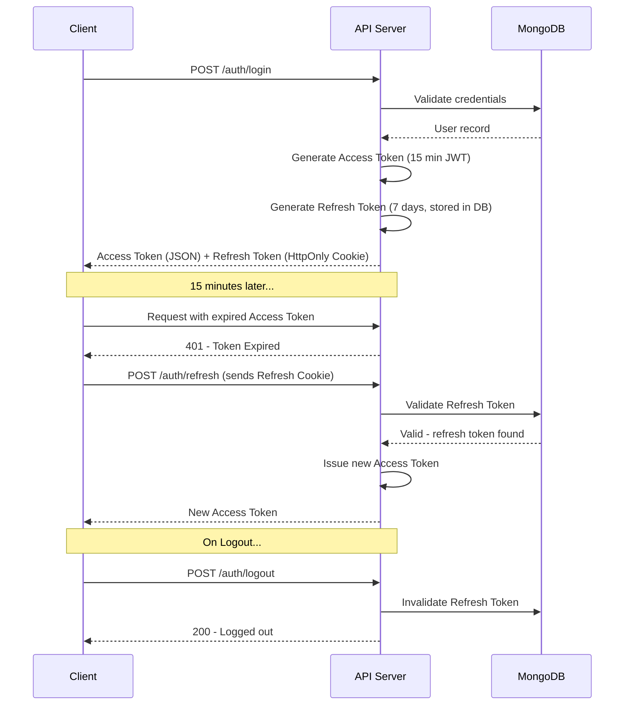

---

## 9. AI & ML Pipeline Design

### 9.1 Embedding Generation Strategy

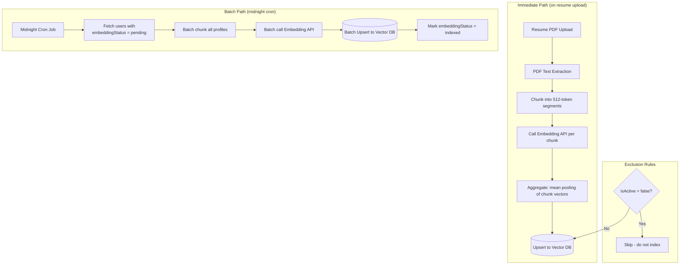

### 9.2 Similarity Search & Ranking Pipeline

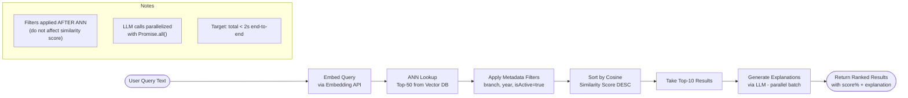

### 9.3 AI Moderation Pipeline

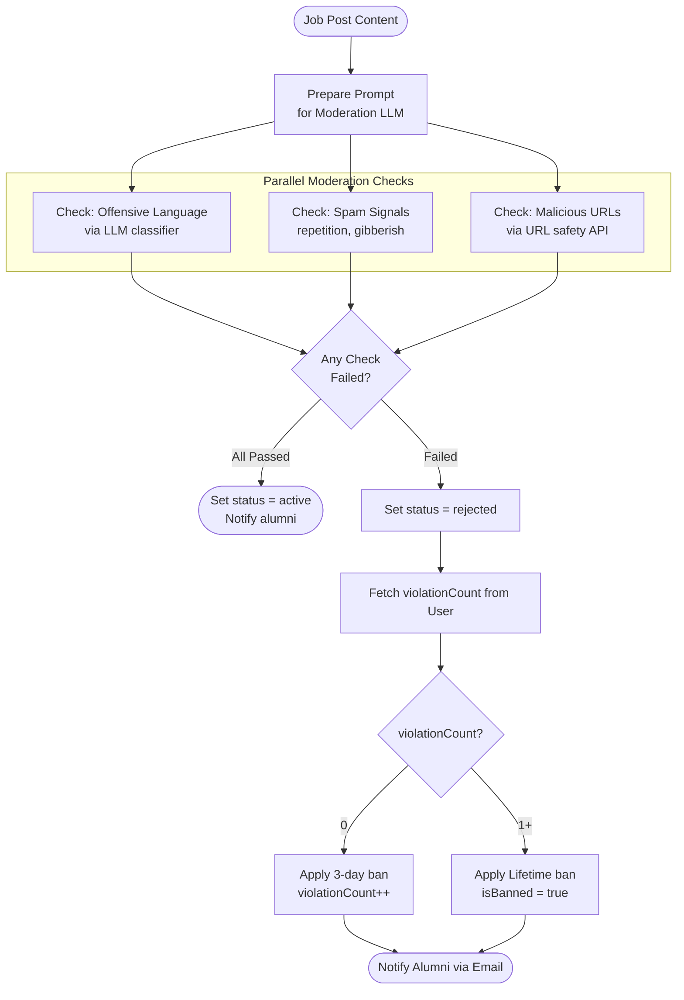

---

## 10. Deployment Architecture

### 10.1 Infrastructure Overview

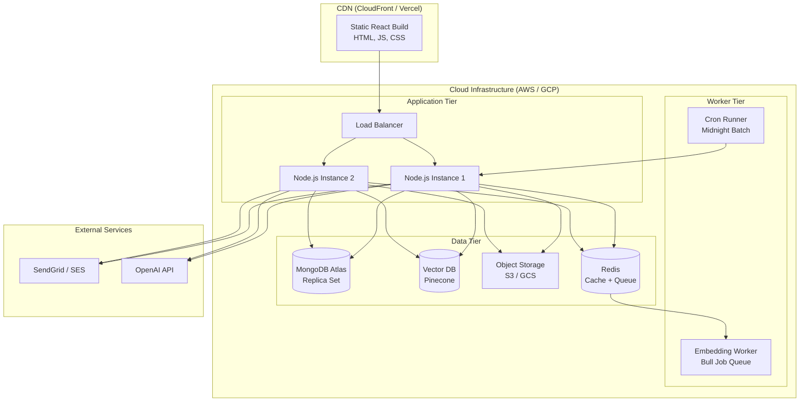

### 10.2 CI/CD Pipeline

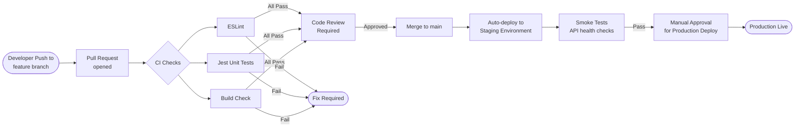

---

## 11. Error Handling & Logging

### 11.1 Error Response Standard

All API errors follow a consistent envelope:

```json
{
  "success": false,
  "error": {
    "code": "VALIDATION_ERROR",
    "message": "email field is required",
    "details": [
      { "field": "email", "issue": "required" }
    ]
  },
  "requestId": "req_abc123",
  "timestamp": "2024-03-01T10:00:00Z"
}
```

### 11.2 Error Code Reference

| HTTP Code | Error Code | Scenario |
|-----------|-----------|---------|
| 400 | `VALIDATION_ERROR` | Invalid request body or params |
| 401 | `UNAUTHENTICATED` | Missing or expired JWT |
| 403 | `FORBIDDEN` | Role not authorized for action |
| 403 | `ACCOUNT_BANNED` | User account is banned |
| 403 | `ACCOUNT_INACTIVE` | Soft-deleted or unverified account |
| 404 | `NOT_FOUND` | Resource does not exist |
| 409 | `CONFLICT` | Duplicate email on register |
| 422 | `UNPROCESSABLE` | PDF parsing failed |
| 429 | `RATE_LIMITED` | Too many requests |
| 500 | `INTERNAL_ERROR` | Unhandled server error |
| 503 | `SERVICE_UNAVAILABLE` | External API (LLM/Embed) down |

### 11.3 Logging Strategy

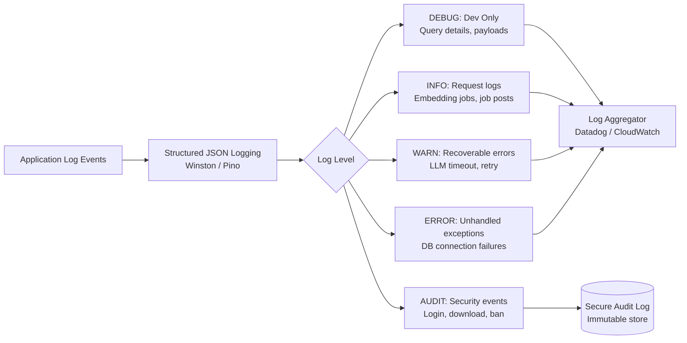

---

## 12. Performance & Scalability

### 12.1 Performance Targets

| Operation | Target Latency | Strategy |
|-----------|---------------|---------|
| AI Search (end-to-end) | < 2 seconds | Parallel ANN + LLM batch |
| Resume Upload | < 5 seconds | Async embedding queue |
| Job Posting | < 1 second | Async moderation queue |
| Profile Fetch | < 300ms | MongoDB index + Redis cache |
| Notification Fetch | < 300ms | Compound index on userId + isRead |

### 12.2 Scalability Design

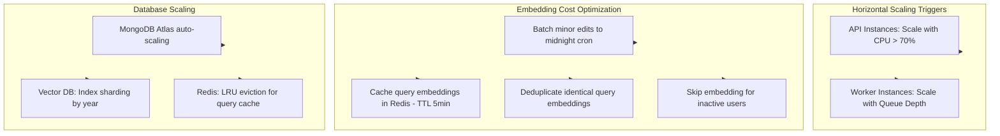

### 12.3 Caching Strategy

| Cache Layer | What is Cached | TTL | Invalidation |
|-------------|---------------|-----|-------------|
| Redis | Query embedding vectors | 5 min | None (TTL-based) |
| Redis | Trending skills result | 1 hour | On new job post |
| Redis | User session metadata | JWT lifetime (15 min) | On logout/ban |
| MongoDB | Student profile (read-heavy) | CDN/App level | On profile update |

---

*End of Software Design Document*

*Next: Implementation follows the module order: Auth → Profile & Resume → Embedding → Search → Jobs → Moderation → Notifications → Analytics*
