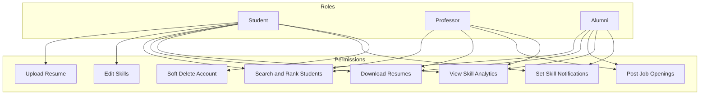
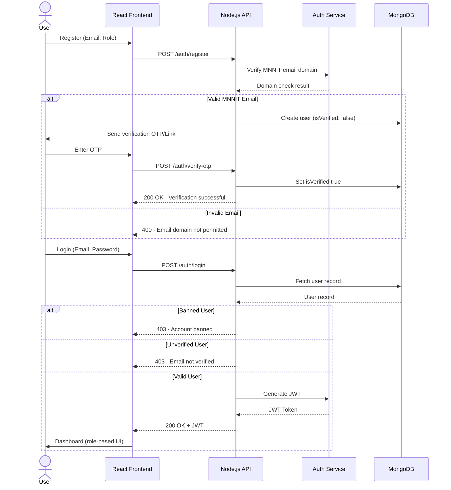
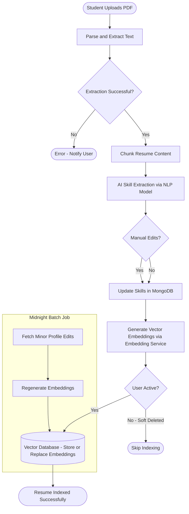
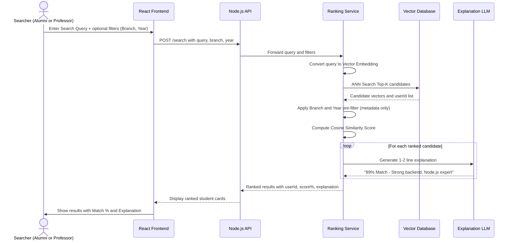
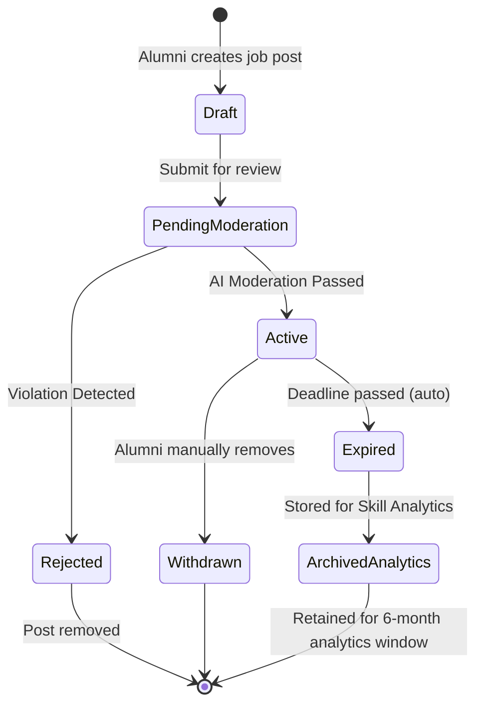
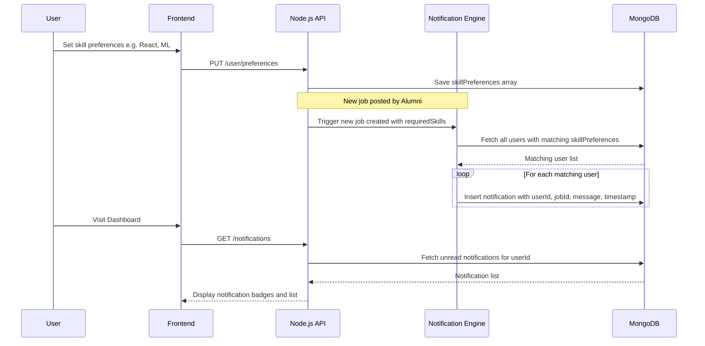
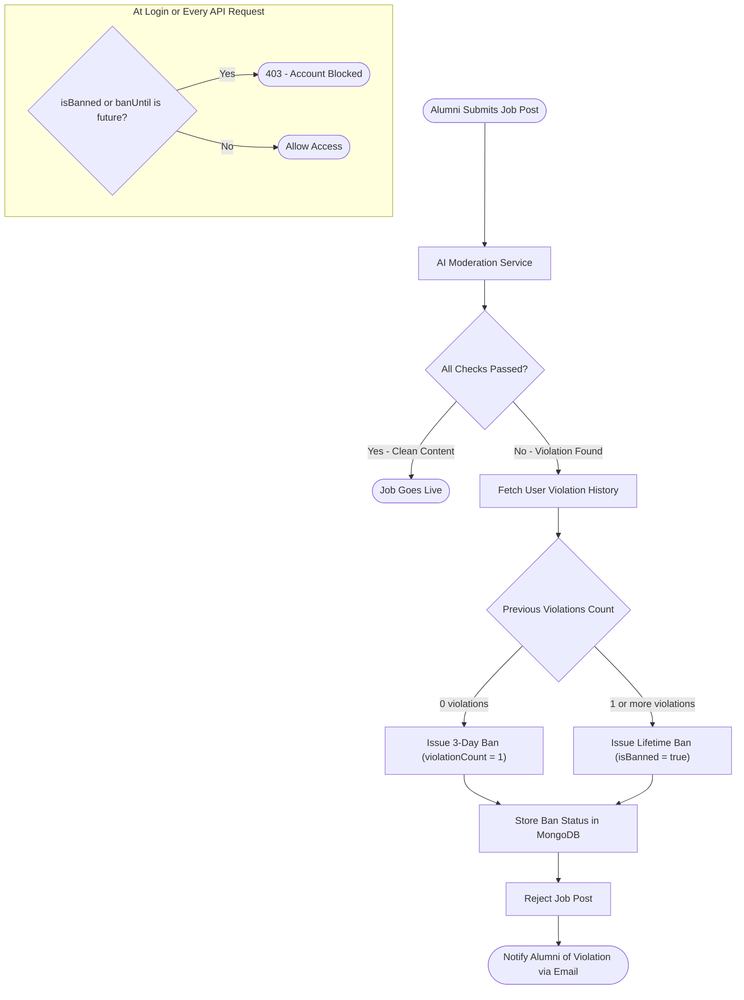
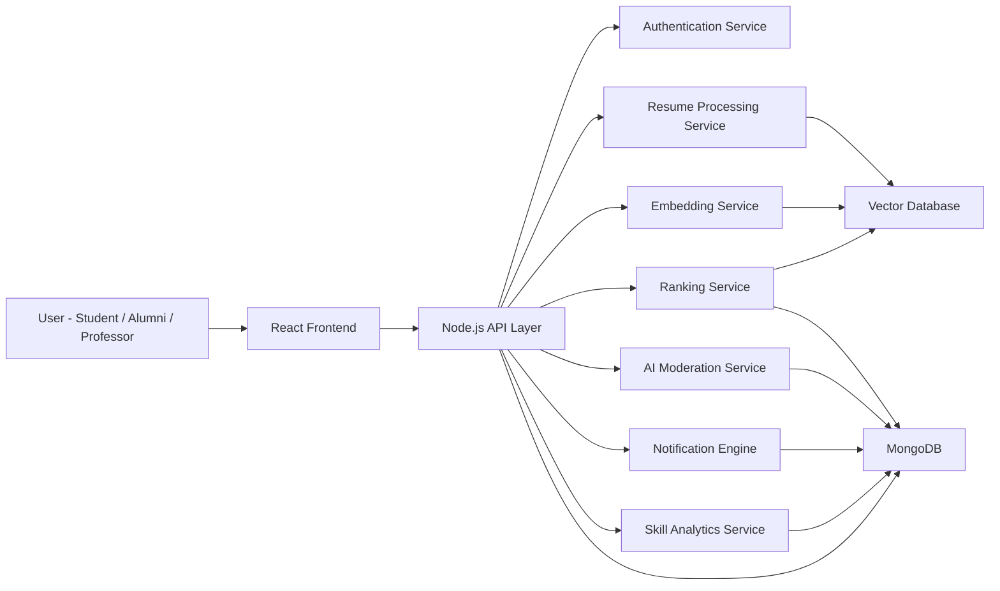
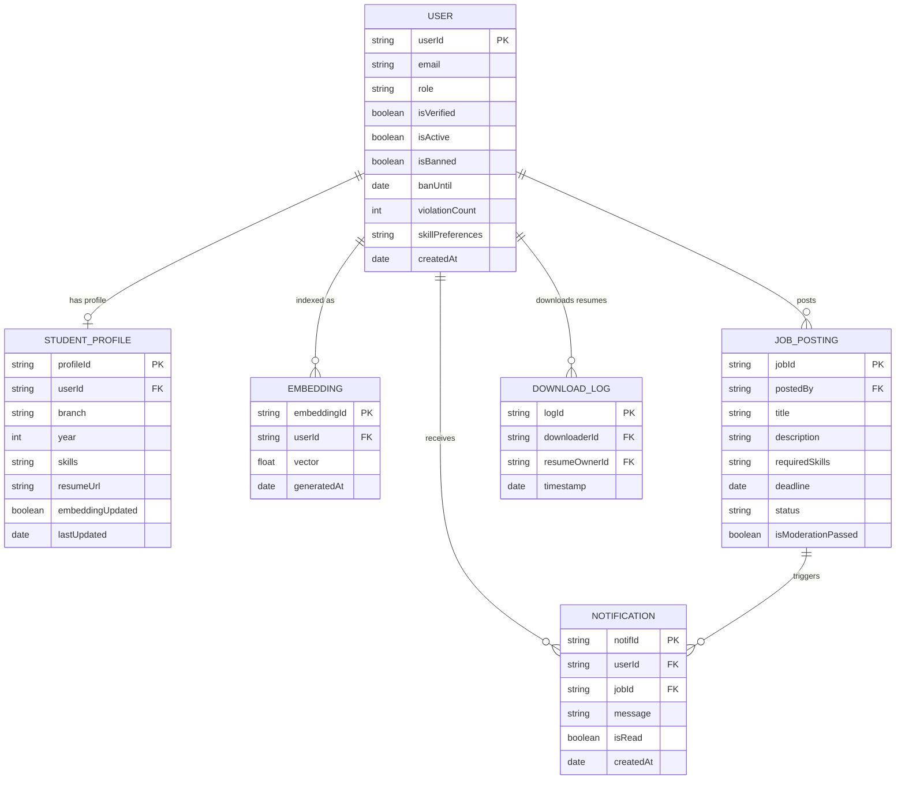
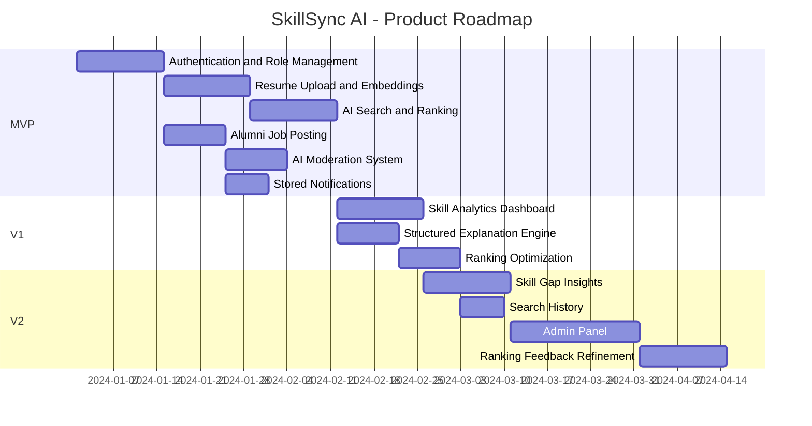

# Product Requirements Document (PRD)

# SkillSync AI – MNNIT Academic Talent Intelligence Platform

**Version:** 1.0
**Product Type:** Closed AI-Powered Academic Networking & Recruitment System

---

## 1. Executive Summary

SkillSync AI is a private, AI-powered talent intelligence platform exclusively for MNNIT students, alumni, and professors.

It enables semantic resume discovery, explainable ranking, alumni-driven job postings, skill trend analytics, and secure internal resume sharing using vector embeddings and similarity-based retrieval.

The platform is restricted to verified MNNIT users only.

---

## 2. Product Vision

To build an internal AI-powered discovery engine that intelligently connects:

* Students
* Alumni
* Professors

within the MNNIT ecosystem through secure, explainable talent matching.

---

## 3. Problem Statement

Current academic networking lacks:

* Semantic resume understanding
* Intelligent student discovery
* Transparent ranking explanations
* Centralized alumni recruitment infrastructure
* Insight into in-demand skills

Manual screening is inefficient and keyword-based. No institutional AI intelligence layer exists.

---

## 4. Product Scope

### 4.1 In Scope (v1)

* Role-based authentication
* Resume upload and skill extraction
* Vector-based semantic ranking
* Alumni-only job posting
* AI-based job moderation
* Skill analytics (last 6 months)
* Preference-based notifications
* Resume download logging
* Soft delete model

### 4.2 Out of Scope (v1)

* Public access
* Internal messaging
* Admin dashboard
* Real-time push notifications
* Interview scheduling
* Ranking feedback loops

---

## 5. User Roles & Verification Model

| Role      | Verification Method               |
| --------- | --------------------------------- |
| Student   | `@mnnit.ac.in` email verification |
| Professor | Official listed email + OTP       |
| Alumni    | Email verification                |

All profiles are visible only to verified users.

### 5.1 Role Permissions Diagram

---

## 6. Functional Requirements

### 6.1 Authentication & Access Control

The system shall:

* Require email verification during registration
* Enforce mandatory role selection
* Issue JWT-based authentication
* Implement role-based access control
* Store and enforce ban status

Acceptance Criteria:

* Unverified users cannot access platform features
* Only alumni accounts can create job postings
* Banned users cannot log in

### 6.1.1 Authentication Flow Diagram

---

### 6.2 Profile Management

Students shall be able to:

* Upload PDF resume
* Auto-extract skills
* Manually edit skills
* Add branch and year
* Soft delete account

Branch and year shall function as filters only.

Acceptance Criteria:

* Resume upload triggers embedding generation
* Soft-deleted users are excluded from search
* Embeddings for inactive users are ignored

---

### 6.3 Resume Processing & Embeddings

The system shall:

* Extract text from uploaded PDF resumes
* Chunk resume content
* Generate vector embeddings
* Store embeddings in vector database
* Link embeddings via userId
* Regenerate embeddings on resume upload
* Perform midnight batch updates for minor profile edits

Acceptance Criteria:

* Only active users are indexed
* Search response time < 2 seconds
* Embedding regeneration optimized for cost

### 6.3.1 Resume Processing Pipeline Diagram

---

### 6.4 AI-Based Query Ranking

The system shall:

1. Accept a user search query
2. Apply optional branch/year filters
3. Convert query to embedding
4. Retrieve top candidates from vector database
5. Rank by similarity score only
6. Display match percentage
7. Generate 1–2 line explanation

Ranking Formula:

Final Score = Vector Similarity Score Only

Acceptance Criteria:

* Filters do not influence similarity score
* Each result displays match percentage
* Explanation is generated for each result

### 6.4.1 AI Ranking Flow Diagram

---

### 6.5 Detailed Profile View

The system shall provide:

* Structured explanation of match
* Bullet list of matched skills
* Experience relevance summary

---

### 6.6 Job Posting (Alumni Only)

The system shall allow alumni to:

* Create job postings
* Add required skills
* Set application deadline

The system shall:

* Automatically hide expired jobs
* Retain expired jobs for analytics

Acceptance Criteria:

* Only alumni role can access job creation
* Expired jobs are not visible in active listings

### 6.6.1 Job Posting Lifecycle Diagram

---

### 6.7 Skill Analytics

The system shall:

* Analyze job postings from last 6 months
* Extract required skills
* Identify trending skills
* Display “Important Skills” section

---

### 6.8 Notifications

The system shall:

* Allow users to set skill preferences
* Match new jobs against preferences
* Store notifications in database

Acceptance Criteria:

* Notifications visible on dashboard
* No real-time push required in v1

### 6.8.1 Notification Flow Diagram

---

### 6.9 Resume Download Logging

The system shall:

* Allow verified users to download resumes
* Log downloaderId, resumeOwnerId, and timestamp

---

### 6.10 AI-Based Moderation

All job postings shall be scanned by AI.

Checks include:

* Offensive language
* Spam content
* Malicious links

Violation Policy:

* 1st violation → 3-day ban
* 2nd violation → Lifetime ban

Acceptance Criteria:

* Ban status stored in user record
* Banned users cannot post jobs

### 6.10.1 AI Moderation & Ban System Diagram

---

## 7. Non-Functional Requirements

* Query response time < 2 seconds
* Secure resume storage
* Scalable for full MNNIT student base
* Controlled API usage
* Closed ecosystem (no public endpoints)
* Embedding updates optimized via batching

---

## 8. Security & Privacy

* Verified access only
* Role-based visibility
* Resume download logging enforced
* Soft delete hides from search but preserves data
* Embeddings excluded for inactive users

---

## 9. Success Metrics

* Average query latency < 2 seconds
* Resume processing success rate > 99%
* Moderation accuracy > 95%
* Monthly active search users growth
* Job-to-search conversion rate

---

## 10. System Architecture Overview

### High-Level Components

* React Frontend (Role-based UI)
* Node.js + Express Backend
* Authentication Service
* Resume Processing Service
* Embedding Service
* Ranking Service
* AI Moderation Service
* Notification Engine
* Skill Analytics Service
* MongoDB (Structured Data)
* Vector Database (Embeddings)

---

## 11. System Architecture Diagram (Mermaid)

### 11.1 Entity Relationship (ER) Diagram

---

## 12. Roadmap

### MVP

* Authentication & role management
* Resume upload & embeddings
* AI search & ranking
* Alumni job posting
* Moderation system
* Stored notifications

### V1

* Skill analytics dashboard
* Structured explanation engine
* Ranking optimization

### V2

* Skill gap insights
* Search history
* Admin panel
* Ranking feedback refinement

### 12.1 Product Roadmap Gantt Chart

---

## 13. Strategic Positioning

SkillSync AI is an internal academic talent intelligence system that leverages vector-based semantic ranking and explainable AI to connect alumni and students within MNNIT securely and intelligently.
